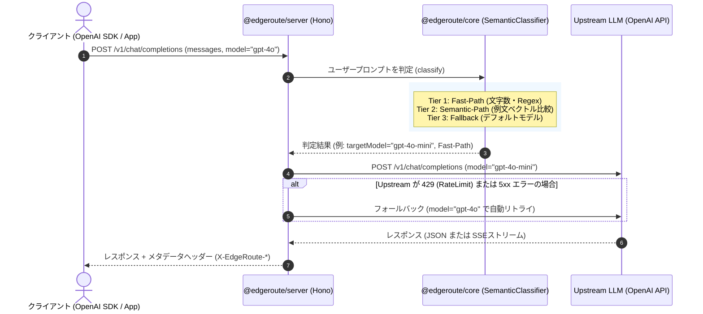

# EdgeRoute 完全学習ガイド & アーキテクチャ解説書

このドキュメントは、**EdgeRoute** のアーキテクチャ、内部設計、各パッケージのコード構造をいつでも復習・理解できるようにまとめた日本語の技術資料です。

---

## 📌 目次
1. [EdgeRoute とは？（開発の背景と目的）](#1-edgeroute-とは開発の背景と目的)
2. [リポジトリ構成 (Monorepo)](#2-リポジトリ構成-monorepo)
3. [全体処理フロー (リクエストの流れ)](#3-全体処理フロー-リクエストの流れ)
4. [@edgeroute/core の仕組みと実装詳細](#4-edgeroutecore-の仕組みと実装詳細)
   - [3層ルーティング判定 (Tier 1〜3)](#3層ルーティング判定-tier-13)
   - [ゼロAPI・超高速ローカル埋め込み (LocalEmbeddingProvider)](#ゼロapi超高速ローカル埋め込み-localembeddingprovider)
   - [コサイン類似度計算 (cosineSimilarity)](#コサイン類似度計算-cosinesimilarity)
   - [トークンコスト & 削減額計算 (cost.ts)](#トークンコスト--削減額計算-costts)
5. [@edgeroute/server の仕組みと実装詳細](#5-edgerouteserver-の仕組みと実装詳細)
   - [Hono によるマルチランタイム対応](#hono-によるマルチランタイム対応)
   - [エンドポイント設計](#エンドポイント設計)
   - [自動障害回復 & フォールバック (proxy.ts)](#自動障害回復--フォールバック-proxyts)
   - [観測性メタデータヘッダー一覧](#観測性メタデータヘッダー一覧)
6. [設定ファイルの書き方 & チューニング方法](#6-設定ファイルの書き方--チューニング方法)
7. [ローカルでの動かし方 & テスト方法](#7-ローカルでの動かし方--テスト方法)
8. [セキュリティ・認証・分散運用のアーキテクチャ](#8-セキュリティ認証分散運用のアーキテクチャ)

---

## 1. EdgeRoute とは？（開発の背景と目的）

### 💡 解決したい課題
LLM（大規模言語モデル）の運用において、すべてのプロンプトを最高性能モデル（`gpt-4o` や `claude-3-5-sonnet` 等）に送信すると**膨大なAPI費用**がかかります。
一方で、簡単な挨拶・要約・フォーマット変換などは、軽量モデル（`gpt-4o-mini` や `gemini-1.5-flash` 等）で十分に対応可能です。

### 🚀 EdgeRoute のアプローチ
EdgeRoute は、**OpenAI 互換のリバースプロキシ**として動作します。
既存のクライアントコード（OpenAI SDK や LangChain など）の接続先 URL を EdgeRoute に向けるだけで、プロンプトの内容を分析し、**自動で最適なモデルに振り分け（ルーティング）** を行います。

- **コスト削減**: 最大 80〜90% の API コスト削減
- **超低遅延**: Edge ランタイム（Cloudflare Workers 等）でも 0〜1ms 台で判定
- **完全透過性**: クライアント側のコード変更は Base URL の変更のみ

---

## 2. リポジトリ構成 (Monorepo)

```text
edgeroute/
├── packages/
│   ├── core/           # 【コア計算エンジン】ルーティング判定・類似度・コスト計算（Node/Web非依存）
│   │   ├── src/
│   │   │   ├── types.ts          # Zod スキーマ & TypeScript 型定義
│   │   │   ├── classifier.ts     # 3階層ルーティング判定器 & コサイン類似度
│   │   │   ├── cost.ts           # モデル単価テーブル & コスト計算ロジック
│   │   │   ├── config.ts         # 設定バリデーション & ヘルパー
│   │   │   └── embeddings/       # ベクトル生成器 (local / openai)
│   │   └── tests/                # core の単体テスト (Vitest)
│   │
│   └── server/         # 【HTTPプロキシ層】Hono を用いた OpenAI 互換サーバー
│       ├── src/
│       │   ├── index.ts          # サーバーファクトリ関数
│       │   ├── routes.ts         # /v1/chat/completions 等のエンドポイント
│       │   └── proxy.ts          # Upstream への通信 & 429/5xx フォールバック
│       └── tests/                # サーバー結合テスト
│
├── examples/           # 実行サンプルの実装例
│   └── basic-server/   # 基本的なサーバー起動スクリプト
└── SPEC.md             # プロジェクト仕様書
```

---

## 3. 全体処理フロー (リクエストの流れ)



---

## 4. @edgeroute/core の仕組みと実装詳細

コアパッケージは外部通信や HTTP に依存せず、純粋な TypeScript ロジックのみで構成されています。

### 3層ルーティング判定 (Tier 1〜3)
[`packages/core/src/classifier.ts`](file:///c:/Users/rin01/sample-dev/edgeroute/packages/core/src/classifier.ts) の `SemanticClassifier.classify(prompt)` は以下の順序で判定します。

1. **Tier 1: Fast-Path（ルールベース判定）**
   - 文字数制限（`minCharacters`, `maxCharacters`）、正規表現（`patterns`）、部分一致キーワードを評価。
   - 一致した場合は **オーバーヘッド 0ms** で対象モデルを即時返却。
2. **Tier 2: Semantic-Path（意味ベクトル類似度判定）**
   - 入力プロンプトをベクトル化し、ルート定義の例文（`examples`）の事前計算ベクトルとコサイン類似度を計算。
   - 設定された閾値（`threshold`: 例 0.75）を超えた中で最高スコアのルートを採用。
3. **Tier 3: Fallback（デフォルトフォールバック）**
   - いずれのルール・類似度にも該当しなかった場合、安全のため設定の `defaultModel`（例: `gpt-4o`）を返却。

---

### ゼロAPI・超高速ローカル埋め込み (`LocalEmbeddingProvider`)
[`packages/core/src/embeddings/local.ts`](file:///c:/Users/rin01/sample-dev/edgeroute/packages/core/src/embeddings/local.ts)

外部の Embedding API を叩くと数十〜数百ミリ秒のレイテンシと通信コストが発生します。
EdgeRoute のデフォルト埋め込み器は、**ローカル環境のみで高速計算**を行います。

- **単語 N-gram**: 単語ごとのハッシュ + 連続する単語の Bigram ハッシュ
- **文字 3-gram**: スペース区切りがない日本語などの言語やソースコードに対応するため、3文字ごとの部分文字列もハッシュ化
- **32-bit FNV-1a ハッシュ**: 高速なビット演算で 256 次元のスロットにマッピング
- **L2 正規化**: コサイン類似度計算を高速化するためベクトルの長さを 1.0 に正規化

---

### コサイン類似度計算 (`cosineSimilarity`)

2 つのベクトル $\vec{A}, \vec{B}$ の類似度を以下の公式で計算します：

$$\text{Cosine Similarity} = \frac{\vec{A} \cdot \vec{B}}{\|\vec{A}\| \|\vec{B}\|}$$

スコアは `-1.0` 〜 `1.0`（通常は `0.0` 〜 `1.0`）となり、`1.0` に近いほど意味や単語構成が類似しています。

---

### トークンコスト & 削減額計算 (`cost.ts`)
[`packages/core/src/cost.ts`](file:///c:/Users/rin01/sample-dev/edgeroute/packages/core/src/cost.ts)

主要モデルの 100 万トークンあたりの単価テーブルを保持しています。

- `calculateTokenCost(model, inputTokens, outputTokens)`: 指定モデルでの消費料金（USD）を算出
- `compareRoutingCost(...)`:
  - 「高価なデフォルトモデルを使った場合の想定コスト」と「実際にルーティングされたモデルのコスト」を比較
  - **削減額 ($)** と **削減率 (%)** を算出

---

## 5. @edgeroute/server の仕組みと実装詳細

### Hono によるマルチランタイム対応
[`packages/server/src/routes.ts`](file:///c:/Users/rin01/sample-dev/edgeroute/packages/server/src/routes.ts)

Web フレームワークとして **[Hono](https://hono.dev/)** を採用しています。
Web 標準の `Request` / `Response` / `fetch` API をベースにしているため、Node.js だけでなく Cloudflare Workers や Vercel Edge でもコードの書き換えなしで動きます。

### エンドポイント設計
- `POST /v1/chat/completions`: OpenAI 互換のチャット補完 API（ストリーミング SSE にも完全対応）
- `GET /v1/models`: 登録されているモデル一覧
- `GET /health`: サーバー稼働状態とルーティング設定情報の取得

### 自動障害回復 & フォールバック (`proxy.ts`)
[`packages/server/src/proxy.ts`](file:///c:/Users/rin01/sample-dev/edgeroute/packages/server/src/proxy.ts)

ルーティング先モデル（例: `gpt-4o-mini`）へリクエストを送信した際、Upstream から **`429 (Rate Limit)`** または **`5xx (サーバー障害)`** が返ってきた場合、自動的に `defaultModel`（例: `gpt-4o`）にフォールバックして再送します。
これにより、特定のモデルの障害時でもクライアント側でエラーにならず、可用性を担保します。

### 観測性メタデータヘッダー一覧
サーバーからのレスポンスには、ルーティング結果を確認できるヘッダーが付与されます：

| ヘッダー名 | 説明 | 例 |
|---|---|---|
| `X-EdgeRoute-Matched-Route` | マッチしたルート名 | `simple-tasks` |
| `X-EdgeRoute-Target-Model` | 実際にリクエストされたモデル名 | `gpt-4o-mini` |
| `X-EdgeRoute-Path` | 選択された判定パス | `fast-path` / `semantic-path` / `fallback` / `fallback-retry` |
| `X-EdgeRoute-Score` | ベクトル類似度スコア | `0.8421` (Fast-Path時は `1.0`, Fallback時は `0.0`) |
| `X-EdgeRoute-Latency-Routing` | ルーティング判定にかかった時間 | `0.18ms` |
| `X-EdgeRoute-Cost-Saved-USD` | 削減できたコスト ($) | `0.002350` |
| `X-EdgeRoute-Cost-Saved-Percent` | コスト削減率 (%) | `94.00%` |

---

## 6. 設定ファイルの書き方 & チューニング方法

[`packages/core/src/types.ts`](file:///c:/Users/rin01/sample-dev/edgeroute/packages/core/src/types.ts) のスキーマに従って記述します。

```typescript
import { defineConfig } from '@edgeroute/core';

export default defineConfig({
  // どのルートにも合致しなかった場合の安全なフォールバックモデル
  defaultModel: 'gpt-4o',

  // プロバイダの認証情報
  providers: {
    openai: {
      apiKey: process.env.OPENAI_API_KEY,
    },
  },

  // 埋め込み方式: 'local' (無料・超高速) または 'openai' (API利用・高精度)
  embedding: {
    provider: 'local',
  },

  // ルーティングルールの定義（上から順に評価）
  routes: [
    {
      name: 'simple-tasks',
      targetModel: 'gpt-4o-mini',
      // Tier 1: ルールベース
      rules: {
        maxCharacters: 200, // 200文字以下
        patterns: [/^(こんにちは|要約して|校正して|JSON変換)/i],
      },
      // Tier 2: 例文による類似度マッチング
      examples: [
        'この文章の誤字脱字を直して',
        '以下の箇条書きを3行で要約して',
        'CSVデータをJSONに変換して',
      ],
      threshold: 0.7, // 類似度閾値 (0.0〜1.0)
    },
    {
      name: 'coding-and-reasoning',
      targetModel: 'claude-3-5-sonnet-latest',
      examples: [
        'TypeScriptでASTパーサーを実装して',
        'マイクロサービスの分散トランザクション設計',
        'Rustの所有権エラーを解決して',
      ],
      threshold: 0.75,
    },
  ],
});
```

---

## 7. ローカルでの動かし方 & テスト方法

### ① ビルド & 型チェック
```bash
# 全パッケージのビルド
npm run build

# 型チェック
npm run typecheck
```

### ② 単体テストの実行 (Vitest)
```bash
npm test
```

### ③ サンプルサーバーの起動
```bash
# examples/basic-server を実行
pnpm --filter basic-server dev
# または tsx / node で直接起動
npx tsx examples/basic-server/index.ts
```

### ④ curl での動作確認
```bash
# 1. ヘルスチェック
curl http://localhost:3000/health

# 2. チャット補完リクエスト (ヘッダー付きで確認)
curl -i http://localhost:3000/v1/chat/completions \
  -H "Content-Type: application/json" \
  -H "Authorization: Bearer $OPENAI_API_KEY" \
  -d '{
    "model": "gpt-4o",
レスポンスヘッダーに `X-EdgeRoute-Target-Model: gpt-4o-mini` や `X-EdgeRoute-Cost-Saved-USD` が返ってくることを確認できます。

---

## 8. セキュリティ・認証・分散運用のアーキテクチャ

### 🔒 1. プロキシ認証 & 踏み台防止 (`auth`)
- **APIキー検証**: `auth.apiKeys`（静的キーリスト）または `auth.validator`（カスタム非同期関数）により、`/v1/*` エンドポイントを保護します。
- **定数時間比較**: タイミング攻撃（サイドチャネル攻撃）を防ぐため、文字列比較には `constantTimeEqual` を使用しています。
- **ヘルスチェックの分離**: `/health` はロードバランサ監視用としてパブリックに解放されます。

### 🛡️ 2. 認証情報の分離と BYOK (Bring Your Own Key)
プロキシ認証用の Bearer トークンが、上流の OpenAI / Anthropic 等に誤って転送・漏洩しないよう隔離されています。
クライアントが自身の API キーを持ち込む（BYOK）場合は、以下のプロバイダ別ヘッダーを使用可能です。
- **OpenAI**: `x-openai-api-key` / `x-provider-api-key`
- **Anthropic**: `x-anthropic-api-key` / `x-api-key`
- **Google Gemini**: `x-goog-api-key` / `x-gemini-api-key`
- **Groq**: `x-groq-api-key`

### ⏱️ 3. レートリミット & DoS ガード (`rateLimit`, `security`)
- **レートリミット**: スライディングウィンドウ方式でクライアント IP または API キーごとにリクエスト数を制御（超過時は `429 Too Many Requests` と `Retry-After` を返却）。
- **ボディサイズ制限**: `security.maxBodySize` により巨大ペイロード（画像爆弾や長大プロンプト）によるメモリ枯渇を防止（超過時は `413 Payload Too Large`）。
- **CORS 制御**: 信頼するオリジンからのみのアクセスを許可。

### 🗄️ 4. 分散環境でのキャッシュ共有 (`UpstashRedisCacheStore`)
サーバーレス（Cloudflare Workers / Vercel Edge）やコンテナ複数台（ECS / K8s）でスケールアウトした場合、インメモリキャッシュではインスタンス間で共有できません。
`UpstashRedisCacheStore` を指定することで、REST 経由でグローバルなキャッシュ共有とセマンティック検索が可能になります。

```typescript
import { UpstashRedisCacheStore } from '@edgeroute/core';

export default defineConfig({
  defaultModel: 'gpt-5.6-sol',
  cache: {
    enabled: true,
    threshold: 0.95,
    store: new UpstashRedisCacheStore({
      url: process.env.UPSTASH_REDIS_REST_URL!,
      token: process.env.UPSTASH_REDIS_REST_TOKEN!,
    }),
  },
  routes: [/* ... */],
});
```

