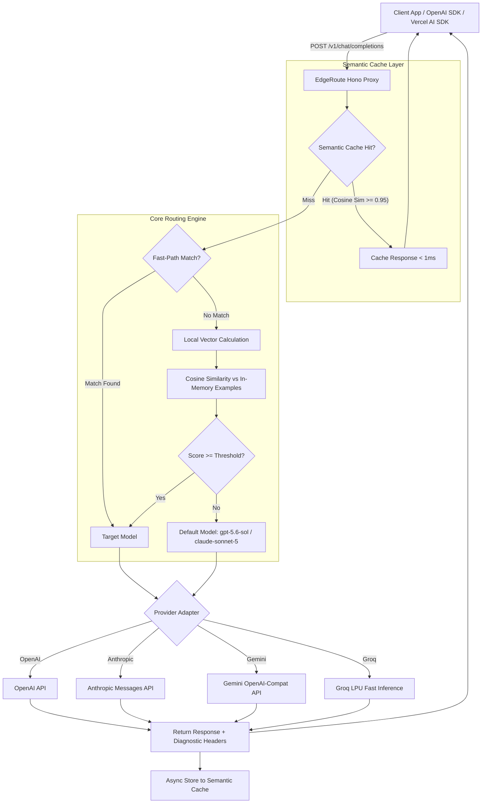

<div align="center">

# EdgeRoute

**Ultra-low latency AI semantic router and cost-optimizing LLM proxy for edge and serverless runtimes.**

[](https://www.typescriptlang.org/)
[](https://opensource.org/licenses/MIT)
[](#)

</div>

---

## Overview

Most existing LLM semantic routing libraries are Python-heavy, have significant boot/runtime overhead, and cannot be deployed directly onto edge platforms (such as Cloudflare Workers, Fastly Compute, or Vercel Edge Functions).

**EdgeRoute** is a lightweight, edge-first TypeScript routing engine and reverse proxy designed for low-latency production environments:

- **Multi-Tier Routing Pipeline**:
  - **Tier 1 (Fast-path)**: Regex, keyword heuristics, and character bounds evaluated with near-zero overhead (`< 0.05ms`).
  - **Tier 2 (Semantic-path)**: In-memory vector cosine similarity against pre-computed route embeddings (`< 0.5ms`).
- **Semantic Caching Layer**: In-memory, Cloudflare KV, and Redis-backed cache serving semantically equivalent queries above a configurable similarity threshold, with full OpenAI-compatible SSE streaming support.
- **Embedded Zero-DB Web Dashboard**: Instant control plane at `/dashboard` featuring real-time cache hit rates, cumulative cost savings, edge latency metrics, recent request logs, and an interactive prompt route simulator.
- **Multi-Provider & Local Inference**: Route seamlessly across **OpenAI** (`gpt-*`, `o1`, `o3-mini`), **Anthropic** (`claude-*`), **Google Gemini** (`gemini-*`), **Groq** (`llama-*`, `mixtral-*`), **DeepSeek** (`deepseek-chat`, `deepseek-reasoner`), **Ollama** (100% free local inference `ollama/*`), and **Azure OpenAI**.
- **Cross-Provider Tool Calling (Function Calling)**: Full transparent translation of `tools`, `tool_choice`, and multi-turn tool results with SSE streaming between OpenAI, Anthropic, and open-source models.
- **Zero-Dependency Runtime Auto-Detection**: Dynamically resolves embedding backends — **Cloudflare Workers AI** (`bge-small-en-v1.5`) on the edge, **Transformers.js** (`all-MiniLM-L6-v2` ONNX) on Node.js/Bun, with zero-dependency lexical fallback.
- **Drop-in OpenAI Compatibility**: Integrates with OpenAI SDK, Vercel AI SDK, LangChain, and LlamaIndex simply by pointing `baseURL` to the proxy.
- **Cross-Provider Failover**: Automatic retry against `defaultModel` across different providers on downstream `429` (Rate Limit) or `5xx` server errors.
- **Telemetry & Cost Accounting**: Injects `X-EdgeRoute-Cache`, `X-EdgeRoute-Cost-Saved-USD`, `X-EdgeRoute-Provider`, and `X-EdgeRoute-Matched-Route` diagnostic headers.

---

## Architecture



---

## Quickstart

### Option A: Cloudflare Workers

Run a production LLM proxy globally with Cloudflare Workers, Workers AI (for neural embeddings), and Cloudflare KV (for distributed cache).

[](https://deploy.workers.cloudflare.com/?url=https://github.com/karakara-rin/edgeroute/tree/main/examples/cloudflare-workers)

```bash
# 1. Clone the ready-to-deploy Cloudflare Worker example
git clone https://github.com/karakara-rin/edgeroute.git
cd edgeroute/examples/cloudflare-workers && npm install

# 2. Create KV Cache namespace
npx wrangler kv namespace create CACHE_KV

# 3. Configure secrets & deploy
npx wrangler secret put OPENAI_API_KEY
npm run deploy
```

---

### Option B: Docker & docker-compose

Run EdgeRoute in containerized environments (Fly.io, Render, AWS ECS, or local machine):

```bash
# 1. Configure environment
cp .env.example .env

# 2. Launch with docker-compose
docker-compose up -d

# 3. Verify health
curl http://localhost:3000/health
```

Or build directly:

```bash
docker build -t edgeroute .
docker run -d -p 3000:3000 -e OPENAI_API_KEY="sk-..." edgeroute
```

---

### Option C: Node.js / TypeScript Proxy Server

#### 1. Installation

```bash
npm install @edgeroute/core @edgeroute/server
```

#### 2. Configuration (`router.config.ts`)

```typescript
import { defineConfig } from '@edgeroute/core';

export default defineConfig({
  // Default reasoning model for fallback
  defaultModel: 'gpt-5.6-sol',

  // Provider credentials
  providers: {
    openai: { apiKey: process.env.OPENAI_API_KEY },
    anthropic: { apiKey: process.env.ANTHROPIC_API_KEY },
    gemini: { apiKey: process.env.GEMINI_API_KEY },
    groq: { apiKey: process.env.GROQ_API_KEY },
  },

  // Embedding backend selection:
  // 'auto' (default) automatically resolves:
  // - Cloudflare Workers -> Workers AI (bge-small-en-v1.5)
  // - Node.js / Bun -> Transformers.js (all-MiniLM-L6-v2)
  // - Fallback -> Fast lexical hash
  embedding: {
    provider: 'auto',
  },

  // Semantic Cache configuration
  cache: {
    enabled: true,
    threshold: 0.95,
    ttl: 3600, // 1 hour TTL
    maxEntries: 1000,
    maxTemperature: 0.2, // Only cache deterministic queries
  },

  // Proxy Authentication
  auth: {
    apiKeys: [process.env.EDGEROUTE_API_KEY || 'sk-edgeroute-proxy-secret'],
  },

  // Sliding Window Rate Limiting
  rateLimit: {
    maxRequests: 100,
    windowMs: 60_000,
  },

  // Security Guardrails
  security: {
    cors: true,
    maxBodySize: 5 * 1024 * 1024, // 5MB payload limit
  },

  routes: [
    {
      name: 'instant-greeting-and-qa',
      targetModel: 'gemini-3.7-flash',
      rules: {
        maxCharacters: 150,
        patterns: [/^(hello|hi|hey|こんにちは)/i],
      },
    },
    {
      name: 'high-speed-code-assist',
      targetModel: 'llama-3.3-70b-versatile',
      threshold: 0.7,
      examples: [
        'Format this JSON string properly',
        'Fix syntax error in this SQL query',
        'Convert this curl command to python requests',
      ],
    },
    {
      name: 'concise-writing',
      targetModel: 'claude-haiku-4-5',
      threshold: 0.75,
      examples: [
        'Fix typos and improve readability',
        'Summarize this customer feedback into bullet points',
      ],
    },
  ],
});
```

#### 3. Initialize Proxy Server

```typescript
import { createEdgeRouteServer } from '@edgeroute/server';
import config from './router.config.js';

const { app } = await createEdgeRouteServer(config);

export default app;
```

#### 4. Consume with OpenAI SDK

```typescript
import OpenAI from 'openai';

const client = new OpenAI({
  apiKey: process.env.OPENAI_API_KEY,
  baseURL: 'http://localhost:3000/v1',
});

const response = await client.chat.completions.create({
  model: 'gpt-5.6-sol', // Dynamically routed or served from cache
  messages: [{ role: 'user', content: 'Hello! How are you?' }],
});
```

---

## Next.js & Vercel AI SDK Integration (`@edgeroute/ai`)

EdgeRoute provides a `LanguageModelV1` adapter for the [Vercel AI SDK](https://sdk.vercel.ai/docs), allowing embedded in-process routing without maintaining a standalone proxy server.

```bash
npm install @edgeroute/ai @edgeroute/core ai @ai-sdk/openai @ai-sdk/anthropic
```

```typescript
// app/api/chat/route.ts
import { streamText } from 'ai';
import { edgeroute } from '@edgeroute/ai';
import { openai } from '@ai-sdk/openai';
import { anthropic } from '@ai-sdk/anthropic';

export const runtime = 'edge';

const router = edgeroute({
  defaultModel: 'gpt-5.6-sol',
  routes: [
    {
      name: 'coding-expert',
      targetModel: 'claude-3-5-sonnet-20241022',
      rules: { patterns: ['refactor', 'architecture', 'typescript'] },
    },
    {
      name: 'quick-qa',
      targetModel: 'gemini-3.7-flash',
      rules: { maxCharacters: 100 },
    },
  ],
  cache: { enabled: true, threshold: 0.95 },
  models: {
    'claude-3-5-sonnet-20241022': anthropic('claude-3-5-sonnet-20241022'),
    'gpt-5.6-sol': openai('gpt-5.6-sol'),
    'gemini-3.7-flash': openai('gemini-3.7-flash'),
  },
});

export async function POST(req: Request) {
  const { messages } = await req.json();

  const result = await streamText({
    model: router,
    messages,
  });

  return result.toDataStreamResponse();
}
```

---

## CLI & Tooling (`@edgeroute/cli`)

The EdgeRoute CLI supports local development, offline verification, threshold tuning, and embedding pre-compilation.

```bash
npm install -g @edgeroute/cli
# or run via npx
npx edgeroute --help
```

### 1. Local Development Server (`edgeroute dev`)

Starts the local proxy server with real-time routing diagnostics:

```bash
npx edgeroute dev --port 3000 --config ./router.config.ts
```

```text
EdgeRoute Dev Server running
──────────────────────────────────────────────────
  • Local:     http://localhost:3000
  • Dashboard: http://localhost:3000/dashboard
  • Health:    http://localhost:3000/health
  • Proxy:     http://localhost:3000/v1/chat/completions
  • Default:   gpt-5.6-sol
  • Routes:    3 configured
──────────────────────────────────────────────────
```

### 2. Single Prompt Routing Test (`edgeroute test`)

Evaluate routing tiers, similarity scores, and estimated cost differentials directly from the terminal:

```bash
# Basic test
npx edgeroute test "Hello, what is the capital of France?"

# Detailed breakdown (candidate scores, token estimates, complexity)
npx edgeroute test "Write a distributed consensus engine in Rust" --verbose

# JSON output for CI integration
npx edgeroute test "Translate this to Japanese" --json
```

### 3. Dataset Simulation & Threshold Tuning (`edgeroute eval`)

Replay historical request logs against your routing configuration to measure cumulative cost savings and determine optimal similarity thresholds:

```bash
# Evaluate baseline against dataset
npx edgeroute eval --dataset ./logs/prompts.jsonl

# Sweep threshold range for optimal precision / cost ratio
npx edgeroute eval --dataset ./logs/prompts.jsonl --tune --threshold-range 0.5:0.95:0.05
```

### 4. Embedding Pre-Compiler (`edgeroute build-embeddings`)

Pre-compile route example vectors ahead of time to eliminate cold-start vectorization overhead on serverless runtimes:

```bash
npx edgeroute build-embeddings --output router.embeddings.json
```

---

## Diagnostic Response Headers

Every upstream response is enriched with transparent metadata headers:

| Header Key | Example | Description |
| :--- | :--- | :--- |
| `X-EdgeRoute-Cache` | `HIT` \| `MISS` \| `BYPASS` \| `SKIPPED` | Semantic cache status |
| `X-EdgeRoute-Cache-Latency` | `0.08ms` | Semantic cache lookup time |
| `X-EdgeRoute-Matched-Route` | `instant-greeting-and-qa` | Matched route identifier or `default` |
| `X-EdgeRoute-Target-Model` | `gemini-3.7-flash` | Dispatched model name |
| `X-EdgeRoute-Provider` | `gemini` \| `anthropic` \| `groq` \| `openai` | Upstream provider |
| `X-EdgeRoute-Path` | `fast-path` \| `semantic-path` \| `fallback` | Decision tier |
| `X-EdgeRoute-Score` | `0.8421` | Highest cosine similarity score |
| `X-EdgeRoute-Cost-Saved-USD` | `0.042300` | Estimated savings vs `defaultModel` |
| `X-EdgeRoute-Cost-Saved-Percent` | `100%` | Relative savings percentage |
| `X-EdgeRoute-Latency-Routing` | `0.12ms` | Classification compute time |
| `X-RateLimit-Limit` | `100` | Allowed requests per window |
| `X-RateLimit-Remaining` | `99` | Remaining quota in window |
| `X-RateLimit-Reset` | `1724912400` | Quota reset timestamp (Unix epoch) |

---

## Design Decisions & Trade-offs

- **Memory vs. Latency in Edge Environments**: Running ONNX embeddings in memory on standard Node.js/Bun instances yields sub-millisecond local vectorization. On resource-constrained edge workers (e.g. 128MB memory limit), EdgeRoute delegates embedding generation to platform-native services (Cloudflare Workers AI) or utilizes pre-compiled vectors (`router.embeddings.json`).
- **Lexical Hash Fallback**: When no neural embedding model is loaded, EdgeRoute uses n-gram frequency hashing. While extremely fast and zero-dependency, lexical hashing does not capture deep semantic meaning. For production semantic routing, configure a neural provider or Cloudflare Workers AI.
- **Failover Scope**: Automatic retry handles transient downstream network issues (`429`, `500`, `502`, `503`, `504`). Non-retryable client errors (`400`, `401`, `403`, `422`) are passed through immediately to preserve upstream error semantics.

---

## Documentation & Architecture

For in-depth technical specifications and architectural design details, see [docs/SPEC.md](file:///docs/SPEC.md).

---

## Development & Testing

```bash
# Run unit & integration test suites
npm test

# Type check packages
npm run typecheck

# Build ESM & CJS distribution bundles
npm run build
```

---

## License

MIT © [EdgeRoute Authors](https://github.com/karakara-rin/edgeroute)
