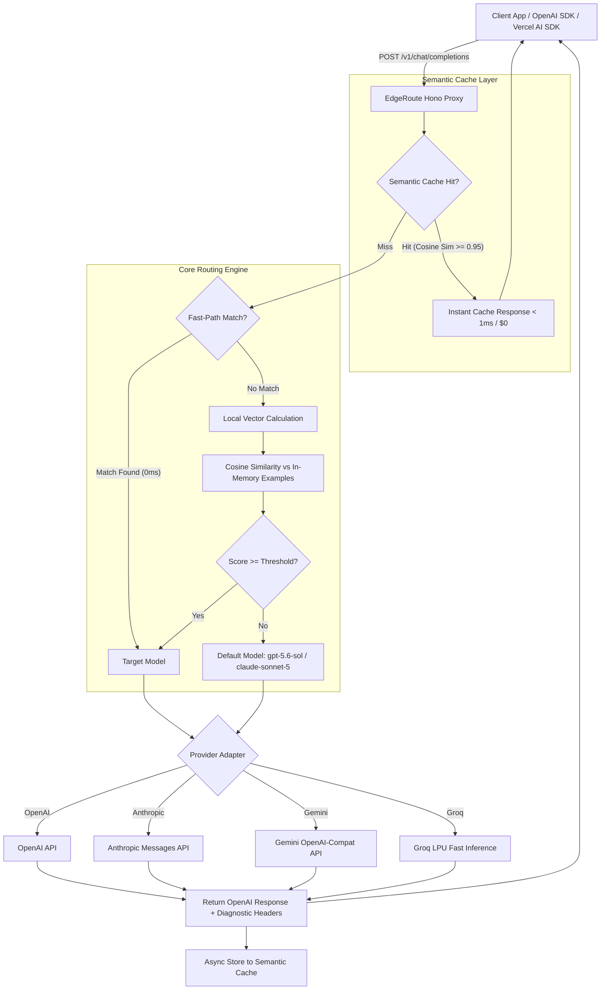

<div align="center">

# ⚡️ EdgeRoute

**Edge-Ready AI Semantic Router & Dynamic Cost-Optimizing LLM Proxy**

Zero-latency rule matching + in-memory vector cosine similarity + OpenAI API drop-in compatibility.

[](https://www.typescriptlang.org/)
[](https://opensource.org/licenses/MIT)
[](#)

</div>

---

## 🌟 Why EdgeRoute?

Most LLM routers are Python-heavy, slow to boot, and impossible to deploy directly to the edge (e.g. Cloudflare Workers, Fastly, Deno Deploy).

**EdgeRoute** is designed from the ground up for ultra-low latency edge environments:

- ⚡ **2-Tier Hybrid Routing**:
  - **Tier 1 (Fast-path)**: Regex & token constraints evaluated in **0.00ms**.
  - **Tier 2 (Semantic-path)**: In-memory cosine similarity against pre-embedded route vectors (**< 0.5ms**).
- 🚀 **Sub-Millisecond Semantic Cache ($0 Cost Immediate Hits)**: In-memory & Cloudflare KV caching layer that serves semantically equivalent past prompts (cosine similarity > threshold) with **< 1ms latency**, $0 API cost, and OpenAI-compatible SSE streaming support.
- 🌐 **Multi-Provider Support**: Seamlessly route between **Anthropic** (`claude-*`), **Google Gemini** (`gemini-*`), **Groq** (`llama-*`, `mixtral-*`, `deepseek-*`), and **OpenAI** (`gpt-*`, `o1`, `o3-mini`) using standard OpenAI client SDKs.
- 🧠 **True Semantic Embedding (Auto-Detected)**: Runtime auto-detection selects the best embedding provider — **Transformers.js** (ONNX `all-MiniLM-L6-v2`) for Node.js/Bun, **Cloudflare Workers AI** (`bge-small-en-v1.5`) for edge — with a zero-dependency lexical hash fallback.
- 🔄 **Drop-in OpenAI Compatibility**: Works instantly with OpenAI SDK, Vercel AI SDK, LangChain, and LlamaIndex simply by pointing `baseURL` to `http://localhost:3000/v1`.
- 🛡️ **Cross-Provider Automatic Failover**: Automatic retry against `defaultModel` (even across different AI providers) on downstream `429` (Rate Limit) or `5xx` server errors.
- 📊 **Real-time Cost Diagnostics**: Injects `X-EdgeRoute-Cache`, `X-EdgeRoute-Cost-Saved-USD`, `X-EdgeRoute-Provider`, and `X-EdgeRoute-Matched-Route` headers into responses.

---

## 🏗️ Architecture



---

## 🚀 Quickstart

### 1. Installation

```bash
npm install @edgeroute/core @edgeroute/server
```

### 2. Configure Router (`router.config.ts`)

```typescript
import { defineConfig } from '@edgeroute/core';

export default defineConfig({
  // Default large reasoning model for fallback
  defaultModel: 'gpt-5.6-sol',

  // Providers configuration
  providers: {
    openai: { apiKey: process.env.OPENAI_API_KEY },
    anthropic: { apiKey: process.env.ANTHROPIC_API_KEY },
    gemini: { apiKey: process.env.GEMINI_API_KEY },
    groq: { apiKey: process.env.GROQ_API_KEY },
  },

  // Embedding provider: 'auto' (default) auto-detects the best provider for your runtime
  //   - Cloudflare Workers → Workers AI (bge-small-en-v1.5, true semantic, $0)
  //   - Node.js / Bun → Transformers.js (all-MiniLM-L6-v2, true semantic, $0)
  //   - Fallback → Hash-based lexical matching (zero dependencies, NOT semantic)
  // Other options: 'transformers', 'workers-ai', 'openai', 'hash'
  embedding: {
    provider: 'auto',
  },

  // Sub-millisecond Semantic Cache configuration
  cache: {
    enabled: true,
    threshold: 0.95, // Cosine similarity threshold
    ttl: 3600, // 1 hour TTL
    maxEntries: 1000,
    maxTemperature: 0.2, // Guardrail: only cache deterministic queries
  },

  routes: [
    {
      name: 'instant-greeting-and-qa',
      targetModel: 'gemini-3.7-flash',
      rules: {
        maxCharacters: 150,
        patterns: [/^(hello|hi|hey|こんにちは)/i],
      },
    },
    {
      name: 'high-speed-code-assist',
      targetModel: 'llama-3.3-70b-versatile',
      threshold: 0.7,
      examples: [
        'Format this JSON string properly',
        'Fix syntax error in this SQL query',
        'Convert this curl command to python requests',
      ],
    },
    {
      name: 'concise-writing',
      targetModel: 'claude-haiku-4-5',
      threshold: 0.75,
      examples: [
        'Fix typos and improve readability',
        'Summarize this customer feedback into bullet points',
      ],
    },
  ],
});
```

### 3. Start the Proxy Server

```typescript
import { createEdgeRouteServer } from '@edgeroute/server';
import config from './router.config.js';

const { app } = await createEdgeRouteServer(config);

export default app; // For Cloudflare Workers or Node.js Hono adapter
```

### 4. Use with OpenAI SDK

```typescript
import OpenAI from 'openai';

const client = new OpenAI({
  apiKey: process.env.OPENAI_API_KEY,
  baseURL: 'http://localhost:3000/v1', // Point to EdgeRoute
});

const response = await client.chat.completions.create({
  model: 'gpt-5.6-sol', // EdgeRoute will dynamically route or serve from cache!
  messages: [{ role: 'user', content: 'Hello! How are you?' }],
});
```

---

## ⚡ Next.js & Vercel AI SDK Integration (`@edgeroute/ai`)

EdgeRoute provides a first-class `LanguageModelV1` adapter for the [Vercel AI SDK](https://sdk.vercel.ai/docs). Use `streamText` or `generateText` directly in Next.js Route Handlers without spinning up a separate proxy server.

```bash
npm install @edgeroute/ai @edgeroute/core ai @ai-sdk/openai @ai-sdk/anthropic
```

```typescript
// app/api/chat/route.ts
import { streamText } from 'ai';
import { edgeroute } from '@edgeroute/ai';
import { openai } from '@ai-sdk/openai';
import { anthropic } from '@ai-sdk/anthropic';

export const runtime = 'edge';

const router = edgeroute({
  defaultModel: 'gpt-4o-mini',
  routes: [
    {
      name: 'coding-expert',
      targetModel: 'claude-3-5-sonnet-20241022',
      rules: { patterns: ['refactor', 'architecture', 'typescript'] },
    },
    {
      name: 'quick-qa',
      targetModel: 'gpt-4o-mini',
      rules: { maxCharacters: 100 },
    },
  ],
  cache: { enabled: true, threshold: 0.95 },
  models: {
    'claude-3-5-sonnet-20241022': anthropic('claude-3-5-sonnet-20241022'),
    'gpt-4o-mini': openai('gpt-4o-mini'),
  },
});

export async function POST(req: Request) {
  const { messages } = await req.json();

  const result = await streamText({
    model: router,
    messages,
  });

  return result.toDataStreamResponse();
}
```

---

## 📡 Diagnostic Response Headers

EdgeRoute enriches every upstream response with transparent routing and caching metadata:

| Header Key | Example | Description |
| :--- | :--- | :--- |
| `X-EdgeRoute-Cache` | `HIT` \| `MISS` \| `BYPASS` \| `SKIPPED` | Semantic cache status |
| `X-EdgeRoute-Cache-Latency` | `0.08ms` | Semantic cache lookup time |
| `X-EdgeRoute-Matched-Route` | `instant-greeting-and-qa` | Name of matched route or `default` |
| `X-EdgeRoute-Target-Model` | `gemini-3.7-flash` | Actual model dispatched to or served from cache |
| `X-EdgeRoute-Provider` | `gemini` \| `anthropic` \| `groq` \| `openai` | Upstream provider utilized |
| `X-EdgeRoute-Path` | `fast-path` \| `semantic-path` \| `fallback` | Decision mechanism |
| `X-EdgeRoute-Score` | `0.8421` | Highest cosine similarity score |
| `X-EdgeRoute-Cost-Saved-USD` | `0.042300` | Estimated USD saved vs. `defaultModel` |
| `X-EdgeRoute-Cost-Saved-Percent` | `100%` | Percentage of cost saved |
| `X-EdgeRoute-Latency-Routing`| `0.12ms` | Microseconds elapsed for classification |

---

## 🧪 Testing & Verification

```bash
# Run Vitest test suite
npm test

# Run TypeScript type check
npm run typecheck

# Build ESM & CJS distribution bundles
npm run build
```

---

## 📄 License

MIT © [EdgeRoute Authors](https://github.com/edgeroute/edgeroute)
