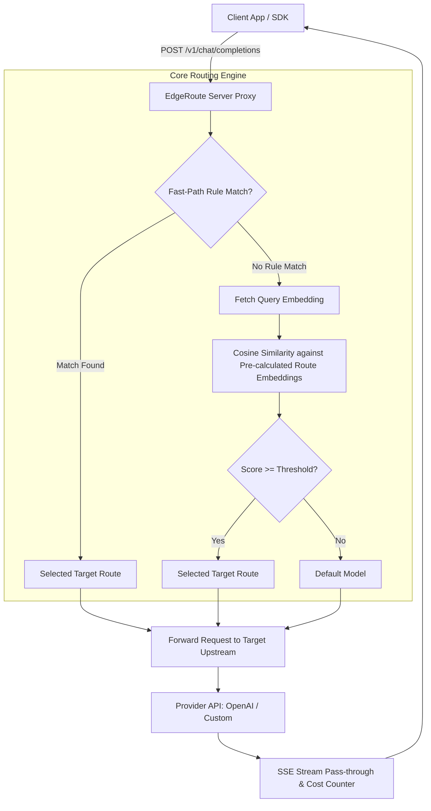

# Technical Specification: EdgeRoute (Edge-Ready AI Semantic Router & Eval)

> **Version**: 0.1.0-draft  
> **Status**: In Review  
> **Target Runtimes**: Cloudflare Workers, Node.js (>=18), Bun, Deno  

---

## 1. Executive Summary & Problem Statement

Large Language Model (LLM) applications face a fundamental tradeoff between **cost/latency** and **reasoning capabilities**:
- Routing all requests to large reasoning models (e.g., `gpt-4o`, `claude-3-5-sonnet`) incurs excessive API costs and higher time-to-first-token (TTFT).
- Existing routing libraries (e.g., RouteLLM, Semantic Router) are predominantly Python-based, bloated with heavy native dependencies, and difficult to deploy to ultra-low-latency edge runtimes (such as Cloudflare Workers or Fastly Compute).
- Developers lack a built-in evaluation feedback loop to empirically verify whether routing to smaller models degrades output quality.

**EdgeRoute** is an ultra-lightweight, edge-first TypeScript semantic router and proxy framework. It enables drop-in OpenAI-compatible routing, multi-tier classification (rule-based fast path + in-memory cosine similarity semantic path), and offline evaluation simulation.

---

## 2. Architecture & Data Flow



### 2.1 Multi-tier Routing Pipeline

1. **Tier 1: Fast-path (Rule-based, 0ms overhead)**
   - Regex patterns (e.g., matching greetings, simple translation requests)
   - Exact prefix / keyword matching
   - Token / character length constraints (e.g., prompt < 50 chars $\rightarrow$ lightweight route)

2. **Tier 2: Semantic-path (Pluggable Local or Cloud Vector Embeddings)**
   - **Local / Zero-API Mode (Default / Edge-first)**: Runs embedded vectorizers (e.g., lightweight ONNX / Transformers.js `all-MiniLM-L6-v2` or fast BM25/TF-IDF token rankers) directly in the edge/Node.js runtime without external API calls or network latency ($0 cost, 100% offline).
   - **Cloud API Mode**: Pluggable provider for OpenAI (`text-embedding-3-small`), Cohere, or Cloudflare Workers AI.
   - At server initialization / build time: Route `examples` are converted to embedding vectors and cached in-memory.
   - At runtime: Compute the embedding of the incoming prompt, then execute in-memory cosine similarity against cached vectors:
     $$\text{similarity}(\mathbf{u}, \mathbf{v}) = \frac{\mathbf{u} \cdot \mathbf{v}}{\|\mathbf{u}\| \|\mathbf{v}\|}$$
   - If $\max(\text{similarity}) \ge \text{route.threshold}$, route to `route.targetModel`.

3. **Tier 3: Fallback & Resilience**
   - If the downstream lightweight model returns an error or rate-limit status (`429`, `5xx`), EdgeRoute automatically retries the request against the large `defaultModel`.

---

## 3. Monorepo Package Structure

```
edgeroute/
├── packages/
│   ├── core/                  # Pure TypeScript, zero external network deps
│   │   ├── src/
│   │   │   ├── classifier.ts  # Fast-path rule matching & cosine similarity math
│   │   │   ├── embeddings/    # Pluggable embedding adapters
│   │   │   │   ├── local.ts   # In-memory / TF-IDF / local tokenizer embedding
│   │   │   │   ├── openai.ts  # OpenAI embeddings adapter
│   │   │   │   └── types.ts   # EmbeddingProvider interface
│   │   │   ├── cost.ts        # Pricing table & token calculation utilities
│   │   │   ├── config.ts      # Configuration parser & validator
│   │   │   ├── types.ts       # TypeScript interfaces and Zod schemas
│   │   │   └── index.ts
│   │   ├── package.json
│   │   └── tsconfig.json
│   │
│   ├── server/                # Hono-based edge-compatible proxy server
│   │   ├── src/
│   │   │   ├── index.ts       # Hono app entry point
│   │   │   ├── routes.ts      # /v1/chat/completions handler
│   │   │   ├── proxy.ts       # Upstream fetcher & fallback retry handler
│   │   │   ├── sse.ts         # SSE streaming pass-through and token tracker
│   │   │   └── cache.ts       # In-memory vector cache for routes
│   │   ├── package.json
│   │   └── tsconfig.json
│   │
│   └── cli/                   # Evaluation & CLI diagnostic tools
│       ├── src/
│       │   ├── index.ts       # CLI command definitions
│       │   ├── eval.ts        # Replay dataset simulation against threshold parameters
│       │   └── report.ts      # Cost reduction & accuracy metrics table generator
│       ├── package.json
│       └── tsconfig.json
│
├── package.json               # Root workspace package.json (pnpm)
├── pnpm-workspace.yaml
├── tsconfig.base.json
└── tsup.config.ts
```

---

## 4. Configuration Schema (`router.config.ts`)

```typescript
import { defineConfig } from '@edgeroute/core';

export default defineConfig({
  // Default fallback model (usually the highest capability model)
  defaultModel: 'gpt-4o',

  // Providers configuration (used for forwarding chat completions)
  providers: {
    openai: {
      apiKey: process.env.OPENAI_API_KEY,
      baseUrl: 'https://api.openai.com/v1', // Optional custom base URL
    },
  },

  // Embedding engine: Choose between 'local' (zero API / zero cost) or 'openai'
  embedding: {
    provider: 'local', // 'local' | 'openai' | 'cloudflare-workers-ai'
    // model: 'all-MiniLM-L6-v2', // for local ONNX/Transformers.js
    // or provider: 'openai', model: 'text-embedding-3-small'
  },

  // Defined routing targets
  routes: [
    {
      name: 'simple-tasks',
      targetModel: 'gpt-4o-mini',
      threshold: 0.78, // Cosine similarity threshold [0.0 - 1.0]

      // Tier 1: Fast-path rules (0ms overhead)
      rules: {
        maxCharacters: 200,
        patterns: [
          /^(hello|hi|hey|good morning|こんにちは)/i,
          /^(translate|summarize|format as json)/i,
        ],
      },

      // Tier 2: Semantic sample prompts
      examples: [
        'Fix spelling and grammar in the following sentence',
        'Convert this JSON data to CSV format',
        'Summarize this paragraph in 3 bullet points',
        'Tell me a short joke',
      ],
    },
    {
      name: 'code-generation',
      targetModel: 'gpt-4o',
      threshold: 0.82,
      examples: [
        'Write a high-performance HTTP server in Rust',
        'Implement a Red-Black tree in TypeScript with unit tests',
        'Debug this race condition in Go goroutines',
      ],
    },
  ],
});
```

---

## 5. API Specification & Header Contracts

### 5.1 Endpoint: `POST /v1/chat/completions`

EdgeRoute is a 100% transparent drop-in replacement for OpenAI's chat completions endpoint.

#### Response Headers Added by EdgeRoute:
| Header Key | Example | Description |
| :--- | :--- | :--- |
| `X-EdgeRoute-Matched-Route` | `simple-tasks` | Name of matched route, or `default` |
| `X-EdgeRoute-Target-Model` | `gpt-4o-mini` | Actual model the request was dispatched to |
| `X-EdgeRoute-Path` | `fast-path` \| `semantic-path` \| `fallback` | Mechanism that resolved the route |
| `X-EdgeRoute-Score` | `0.8421` | Highest cosine similarity score (if semantic path) |
| `X-EdgeRoute-Cost-Saved-USD`| `0.00234` | Estimated savings vs. running on `defaultModel` |
| `X-EdgeRoute-Latency-Routing`| `4.2ms` | Routing classification latency |

---

## 6. Evaluation & Simulation Engine (`@edgeroute/cli`)

The CLI allows running historical prompt datasets through the router under varying threshold values to calculate:
- **Routing Distribution Ratio**: e.g., 68% Mini, 32% Large
- **Estimated Cost Savings ($ / %)**: Cumulative savings compared to 100% large model usage
- **Latency Distribution (p50 / p95 / p99)**

```bash
# Run evaluation simulation on past request logs
pnpm edgeroute eval --dataset ./logs/production-prompts.jsonl --threshold-range 0.6:0.9:0.05
```

---

## 7. Development Roadmap

### Phase 1: Core Foundation & Basic Proxy (Sprint 1)
- [ ] Initialize pnpm workspace and TypeScript tooling (`tsup`, `vitest`).
- [ ] Implement `@edgeroute/core` (Zod schemas, cosine similarity vector math, Fast-path rule evaluation).
- [ ] Implement `@edgeroute/server` with Hono (non-streaming OpenAI proxy, vector in-memory caching).
- [ ] Comprehensive unit tests with Vitest.

### Phase 2: Streaming & Edge Deployment (Sprint 2)
- [ ] Implement Server-Sent Events (SSE) streaming pass-through.
- [ ] Implement automatic fallback retry on upstream `429` / `5xx` responses.
- [ ] Create Cloudflare Workers & Bun deployment examples (`wrangler.toml`).

### Phase 3: Evaluation Engine & Open Source Launch (Sprint 3)
- [ ] Implement `@edgeroute/cli` for log analysis and threshold sweep simulations.
- [ ] Prepare comprehensive documentation (`README.md`, Quickstart guide, Architecture diagrams).
- [ ] GitHub release, CI/CD with GitHub Actions, npm package publishing.
